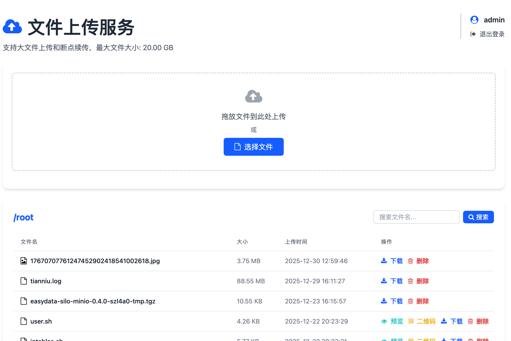
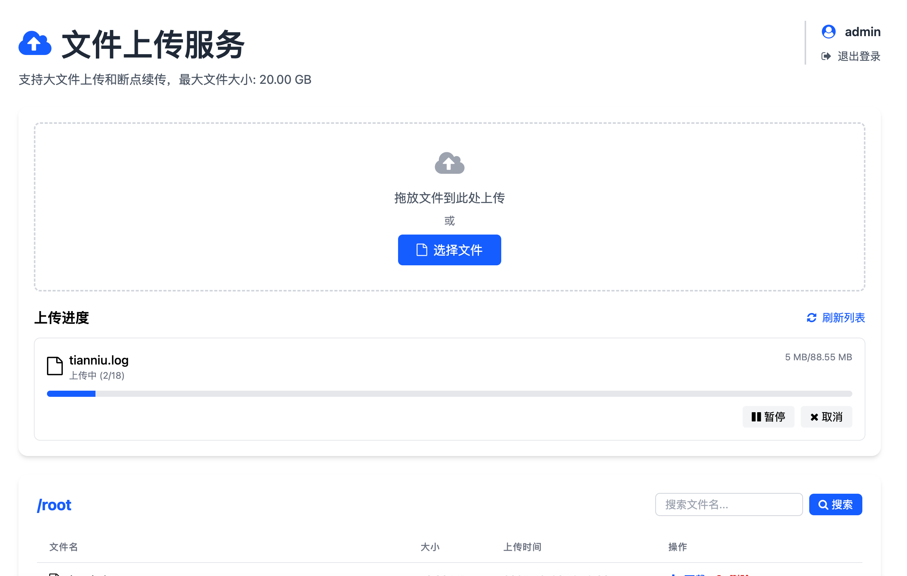
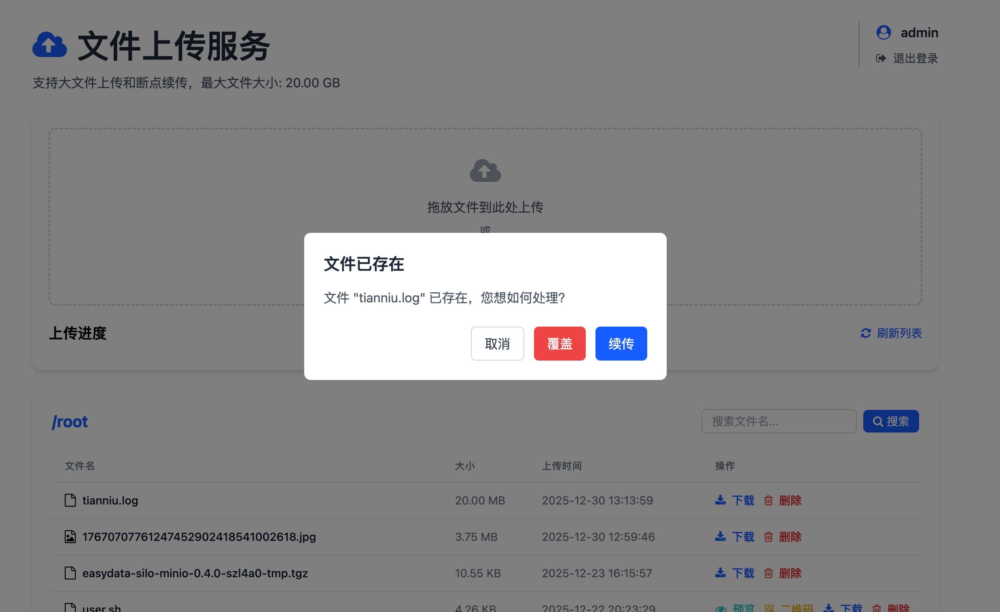
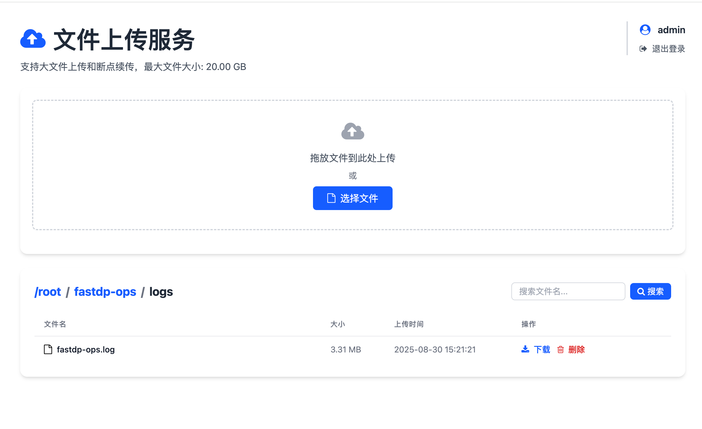
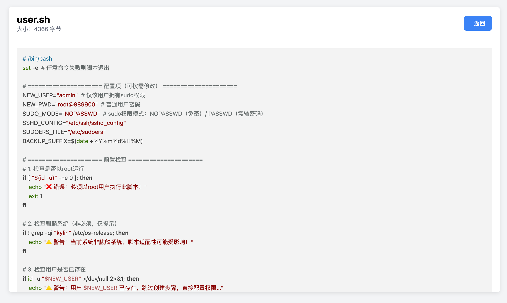

# SimpleHttpServer - 轻量高效文件上传服务
基于 Gin 框架开发的高性能文件上传服务，专注于大文件传输、断点续传和私有化文件管理场景，无需复杂配置即可快速部署，适配各类 Linux 环境。

## 🌟 核心亮点
- **大文件分片上传**：自动将大文件拆分多块传输，降低网络波动影响。
- **断点续传机制**：上传中断（网络断开、客户端退出）后，重新上传可自动跳过已完成分片，无需从头开始。
- **私有化文件管理**：支持文件查看、下载、删除全生命周期管理，小文本文件可直接在线预览。
- **二维码便捷分享**：10KB 以内小文件可生成二维码，分块扫码即可获取，解决部分私有化环境下文件提取限制痛点。
- **零依赖快速部署**：Go 语言编译生成单文件，无额外依赖，支持 systemd 后台运行与开机自启。
- **安全访问控制**：管理员账号密码登录管理，文件下载链接加入白名单，无需登录即可直接下载。
- **响应式 UI 设计**：移动端浏览器适配有限，推荐使用pc端chrome浏览器，上传进度实时可视化展示。

## 🛠️ 技术栈
| 类型 | 技术选型 |
|------|----------|
| 后端框架 | Gin（高性能 Go 语言 Web 框架） |
| 前端技术 | HTML5 + CSS3 + JavaScript |
| 图标库 | Font Awesome（直观功能图标） |
| HTTP 客户端 | axios（异步请求与进度监控） |
| 部署支持 | systemd（服务进程管理） |

## 🚀 快速开始（推荐）
无需编译，直接下载发行版，3 步完成部署，支持 Linux amd64/arm64 架构。

### 前提条件
- 支持 systemd 的 Linux 系统（不支持systemd的系统手动启动亦可完成）。
- 网络端口通畅，确保端口（默认 18181）未被占用。

### 部署步骤
1. **下载对应架构发行包**
    - amd64 架构：
      ```bash
      wget https://gitee.com/zhao-pengfei2/simple-http-server-new/releases/download/v1/SimpleHttpServer-v1-linux-amd64.tar.gz
      ```
    - arm64 架构：
      ```bash
      wget https://gitee.com/zhao-pengfei2/simple-http-server-new/releases/download/v1/SimpleHttpServer-v1-linux-arm64.tar.gz
      ```

2. **解压安装包**
   ```bash
   # 解压压缩包（以 amd64 为例，arm64 替换对应文件名）
   tar -zxvf SimpleHttpServer-v1-linux-amd64.tar.gz
   # 进入安装目录
   cd SimpleHttpServer
   ```

3. **一键安装并启动**
   ```bash
   # 执行安装脚本（需 root 或 sudo 权限，自动配置 systemd 服务）
   sudo bash install.sh
   ```

### 安装后验证
```bash
# 查看服务状态
systemctl status SimpleHttpServer
# 预期输出：active (running) 表示启动成功
```

### 访问服务
打开浏览器，输入 `http://服务器IP:18181`，使用默认账号密码登录：
- 用户名：`admin`
- 密码：`admin@123`

## ⚙️ 源码编译（开发者选项）
如需自定义功能，可通过源码编译部署，需提前安装 Go 1.16+ 环境。

### 编译步骤
1. **克隆源码仓库**（假设仓库地址为示例，需替换为实际地址）
   ```bash
   git clone https://gitee.com/zhao-pengfei2/simple-http-server-new.git
   cd simple-http-server-new
   ```

2. **编译生成可执行文件**
   ```bash
   # 编译（自动处理依赖，生成 SimpleHttpServer 可执行文件）
   go build -o SimpleHttpServer cmd/main.go
   ```

3. **手动启动服务**
   ```bash
   # 直接启动（使用默认配置）
   ./SimpleHttpServer
   # 或指定参数启动（示例：修改端口为 8080，上传目录为 myuploads）
   ./SimpleHttpServer -P 8080 -d myuploads
   ```

4. **（可选）配置 systemd 管理**
   将编译后的文件复制到任意目录，参考安装脚本中的 systemd 配置，手动创建服务文件即可实现systemd管理。

## 📋 功能使用指南
### 1. 文件上传
- 登录后点击首页「选择文件」，支持单次上传多个文件（默认最大 20GB，可通过参数调整）。

- 上传过程中实时显示进度条，支持暂停/继续上传，网络中断后重新上传会自动续传。


- 支持上传到子目录

### 2. 文件管理
本服务提供完善的文件全生命周期管理能力，支持多目录层级浏览、分页查看、精准搜索、在线预览、便捷下载及安全删除，操作简洁高效。
- **查看文件**：首页展示所有目标目录中文件及子目录中文件，包括文件名、大小、上传时间，支持面包屑导航，当文件记录数大于 10 条时，自动启用分页展示。

- **预览文件**：点击小文本文件（如 .txt、.md .sh .conf 等）后的「预览」按钮，可直接在线查看内容。

- **下载文件**：点击「下载」按钮获取文件，或复制下载链接分享给他人（无需登录即可下载）。
- **删除文件**：管理员可点击「删除」按钮移除不需要的文件，操作不可逆，请谨慎操作。
- **文件搜索**：在文件列表顶部配备搜索框，支持对当前目录下按文件名进行「模糊匹配搜索」。

### 3. 二维码分享
- 对于 10KB(可通过启动命令参数修改10KB限制，但大文件不建议此方式) 以内的小文件，上传完成后会显示「生成二维码」按钮。
- 点击按钮生成文件二维码，手机扫码即可下载，适用于无网络拷贝权限的私有化场景。
- 扫码后纯文本文件直接拼接即可，二进制文件为base64编码值，需要拼接后解码使用。


### 4. 配置参数自定义
支持通过命令行参数调整服务配置，执行 `./SimpleHttpServer --help` 查看所有参数：

| 参数缩写 | 参数名 | 默认值 | 说明                          |
|----------|--------|--------|-----------------------------|
| -o | --qr-size | 10240 B（10KB） | 可生成二维码的最大文件大小，不建议增大（识别困难）   |
| -c | --chunk | 5 MB | 大文件分片大小，根据网络情况调整（如网络差可适当缩小） |
| -d | --dir | uploads | 文件上传存储目录（相对当前启动目录，可设置其他绝对路径） |
| -M | --max-size | 20 GB | 单次上传最大文件大小限制                |
| -p | --password | admin@123 | 管理员登录密码           |
| -P | --port | 18181 | 服务监听端口（需确保端口未被占用）           |
| -u | --username | admin | 管理员登录用户名                    |

**示例**：修改登录密码为 `MyPass123`，最大上传文件为 50GB：
```bash
./SimpleHttpServer -p MyPass123 -M 50
```

## 🛡️ 安全与注意事项
1. 建议修改管理员密码，避免未授权访问。
2. 服务仅支持 HTTP 协议，如需 HTTPS 加密传输，可搭配 Nginx 反向代理实现。
3. 定期清理上传目录，避免磁盘空间占用过多，尤其是临时分片文件（系统会自动清理已合并的分片）。
4. 请勿上传涉密、违法违规文件，确保文件传输与存储符合相关法律法规。
5. 防火墙需开放配置的服务端口（默认 18181），否则外部无法访问。

## ❓ 常见问题
### Q1：安装后启动失败，提示「端口被占用」？
A：使用 `-P` 参数指定未被占用的端口，例如 `./SimpleHttpServer -P 8081`，或关闭占用该端口的进程。
B：使用脚本部署方式，直接修改脚本中参数重新执行脚本即可。

### Q2：上传文件取消或中断后重新上传相同文件无响应问题
A：刷新浏览器页面重试即可

### Q3：忘记管理员密码怎么办？
A：通过命令行启动时指定新密码，例如 `./SimpleHttpServer -p 新密码`，启动后使用新密码登录。
B：使用脚本部署方式，直接修改脚本中参数重新执行脚本即可。

### Q4：上传的文件存储在哪里？
A：默认存储在启动目录下的 `uploads` 文件夹，可通过 `-d` 参数自定义存储目录。

## 📌 版本信息
- 当前版本：v1
- 更新日志：初始版本，支持大文件上传、断点续传、文件管理、二维码分享核心功能。

## 🎯 适用场景
- 私有化部署的文件传输需求（如内网服务器间文件共享）。
- 开发/测试环境的临时文件上传与分发。
- 嵌入式设备（ARM 架构）的轻量文件管理服务。
- 无云存储权限场景下的小文件快速分享。